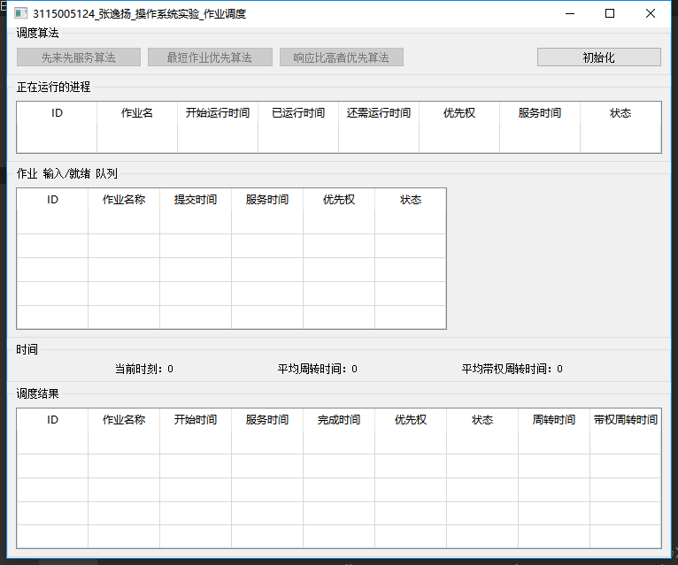
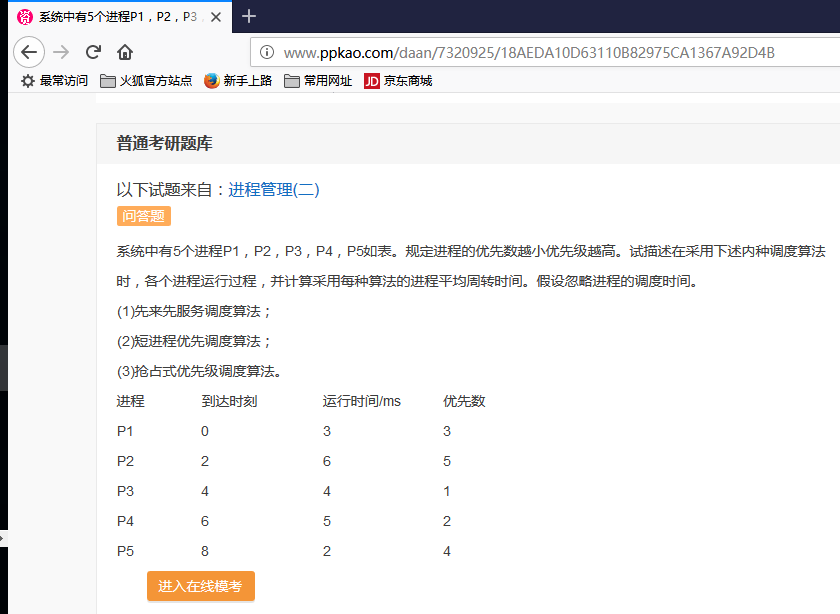
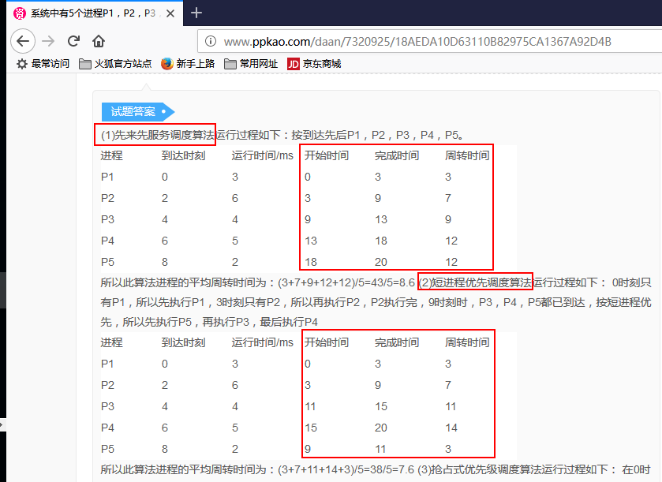
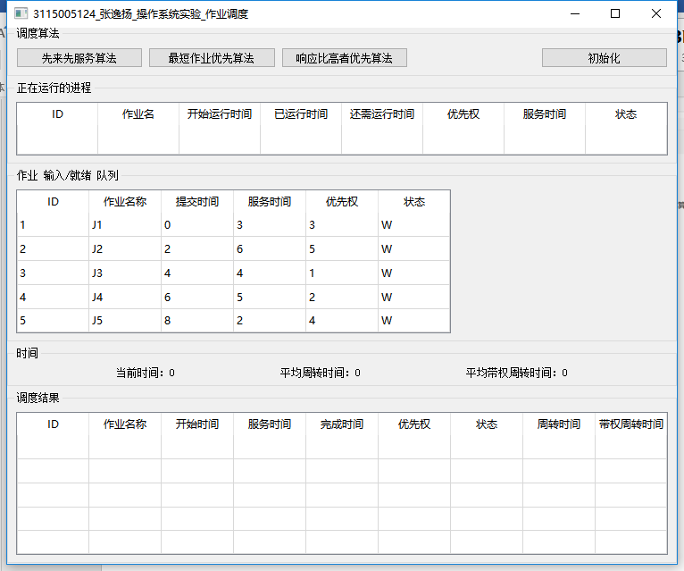
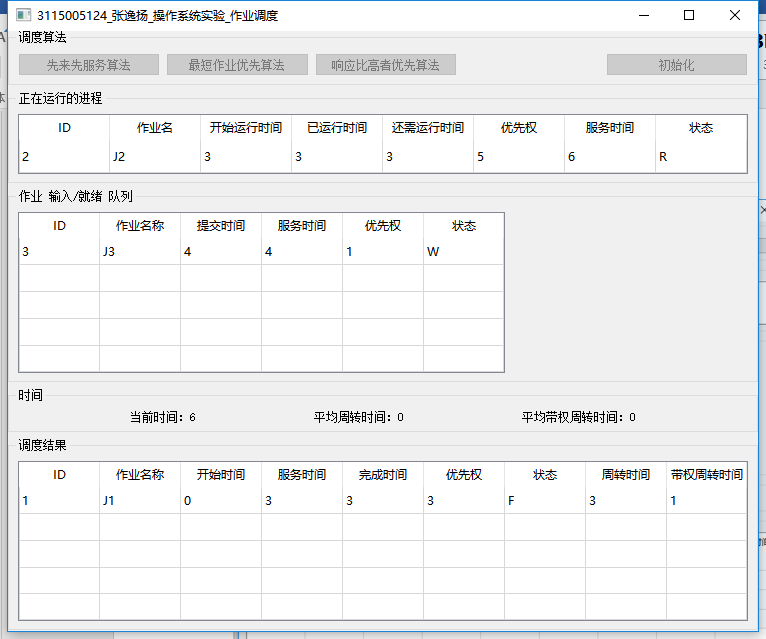
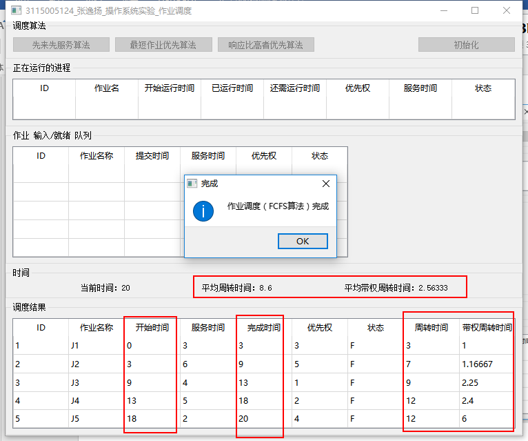
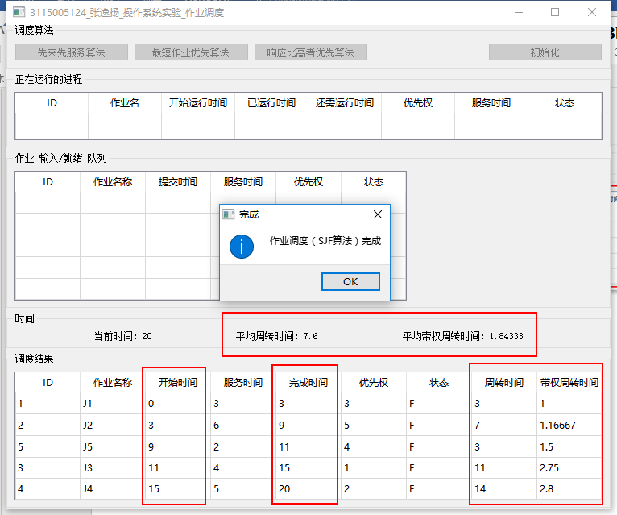
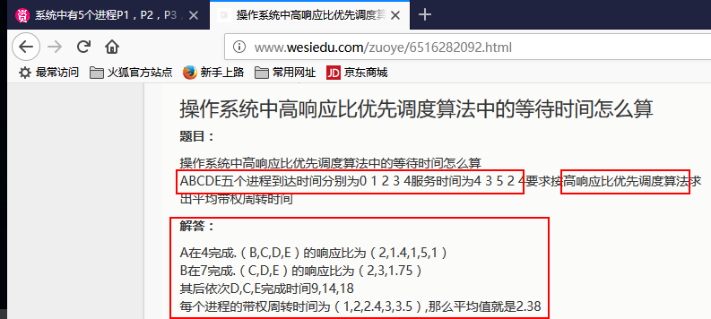
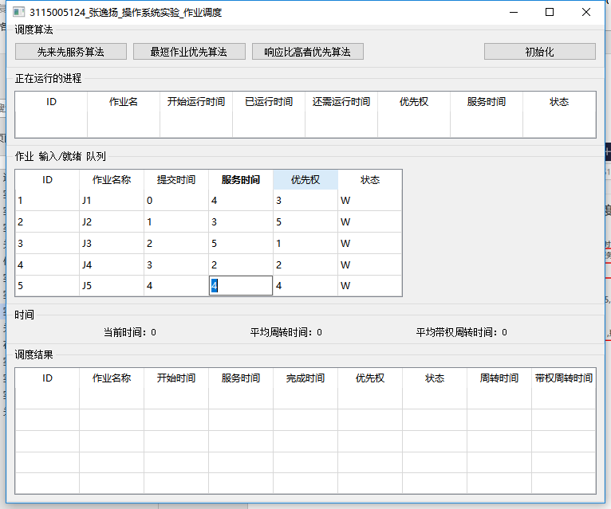
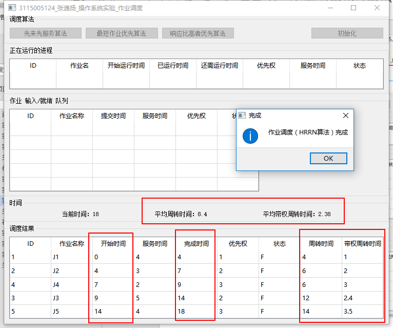

# OS_Exp_job

「操作系统」实验二：作业调度

## 1 实验目的

用高级语言编写和调试一个或多个作业调度的模拟程序，以加深对作业调度算法的理解。

## 2 实验内容

1． 编写并调试一个单道处理系统的作业等待模拟程序。

    作业等待算法：分别采用先来先服务（FCFS），最短作业优先（SJF）、响应比高者优先（HRN）的调度算法。

    对每种调度算法都要求打印每个作业开始运行时刻、完成时刻、周转时间、带权周转时间，以及这组作业的平均周转时间及带权平均周转时间，以比较各种算法的优缺点。

2． 编写并调度一个多道程序系统的作业调度模拟程序。

    作业调度算法：采用基于先来先服务的调度算法。可以参考课本中的方法进行设计。

    对于多道程序系统，要假定系统中具有的各种资源及数量、调度作业时必须考虑到每个作业的资源要求。

3． 编写并调试一个多道程序系统的作业调度模拟程序。

    作业调度算法：采用基于优先级的作业调度。

    可以参考课本中的例子自行设计。

## 3 实验运行截图

▲程序主界面，此时可选择“初始化”。“正在运行的作业”表格 与 “调度结果”表格 不可选中编辑。“作业 输入/输出 队列”表格 可以选中编辑。

▲对于“先来先服务算法”与“最短作业优先算法”的演示，此处选择 网上一道 考研题来验证 程序运行的正确性。

▲“作业 输入/就绪 队列”中输入数据。

▲点击“先来先服务算法”按钮。程序设计为动态演示调度过程，现实中每经过1秒，当前时刻增加1秒。

▲先来先服务算法 调度结果，如图。经比对，结果正确。

▲最短作业优先算法 调度结果，如图。经比对，结果正确。

▲对于“最高响应比优先算法”的演示，此处选择 网上另一道习题 来验证程序运行的正确性。

▲“作业 输入/调度 队列”中输入数据。

▲响应比高者优先算法 调度结果，如图。经比对，结果正确。

## 4 关键代码

略。